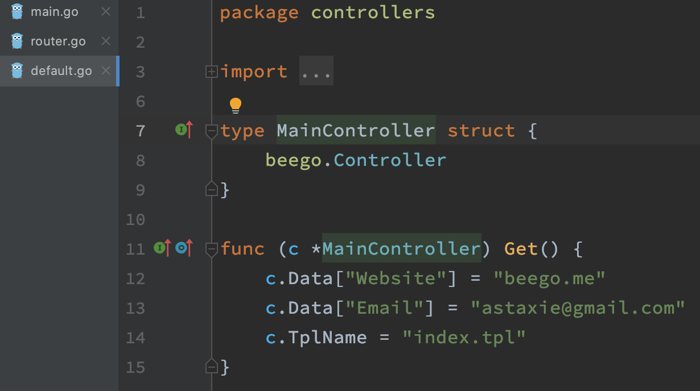

# beego

b站：https://www.bilibili.com/video/BV1cg4y1B7Ev?p=2&vd_source=250675555ac1a6ea844e57e7bfdfef27

github：https://github.com/rubyhan1314/Golang-100-Days/blob/master/Day36-37(beego%E6%A1%86%E6%9E%B6)/day37_beego%E6%A1%86%E6%9E%B6%E6%80%BB%E7%BB%93%E5%8F%8A%E6%95%B0%E6%8D%AE%E5%BA%93%E8%BF%9E%E6%8E%A5%E9%85%8D%E7%BD%AE.md

# 一、beego框架介绍
## 1.1 beego简介
#### 1.1.1 什么是beego
​	beego是一个使用Go语言来开发WEB引用的GoWeb框架，该框架起始于2012年，由一位中国的程序员编写并进行公开，其目的就是为大家提供一个高效率的web应用开发框架。该框架采用模块封装，使用简单，容易学习。方便技术开发者快速学习并进行实际开发。对程序员来说，beego掌握起来非常简单，只需要关注业务逻辑实现即可，框架自动为项目需求提供不同的模块功能。

#### 1.1.2 beego框架特性
Beego框架的主要特性：

**1）简单化：**

​	RESTful支持，MVC模型；可以使用bee工具来提高开发效率，比如监控代码修改进行热编译，自动化测试代码，以及自动化打包部署等丰富的开发调试功能。

**2）智能化：**

​	beego框架封装了路由模块，支持智能路由，智能监控，并可以监控内存消耗，CPU使用以及goroutine的运行状况，方便开发者对线上应用进行监控分析。

**3）模块化：**

​	beego根据功能对代码进行节耦封装，形成了Session，Cache，Log，配置解析，性能监控，上下文操作，ORM等独立的模块，方便开发者进行使用。

**4）高性能：**

​	beego采用Go原生的http请求，goroutine的并发效率应付大流量的Web应用和API应用。

## 1.2 beego安装
#### 1.2.1 Go语言版本要求
**【注意】：**在安装的时候，有一点大家要注意，beego框架要求Go 语言版本1.1+以上，这个我们大家的版本应该至少也是1.9的吧，应该都没有。或者大家现在在命令行中，执行go version查看一下自己的go语言版本。

#### 1.2.2 beego安装命令
现在，我们来执行安装命令：
```go
go get github.com/astaxie/beego
```
等待go将源代码下载安装完毕，我们就可以在我们自己设置的GOPATH下面的src目录下找到beego框架源码。

#### 1.2.3 编写第一个beego程序

那么，我们首先来看一个最最简单的例子beego项目的例子，这个例子就一句话：
* 1、编写第一个beego示例项目

    ```go
    package main
    import "github.com/astaxie/beego"
    func main() {
        beego.Info("第一个beego案例")
        beego.Run("localhost:8080")
    }
    ```
* 2、编译
  
    ```shell
    go build -o hello hello.go
    ```
    
* 3、执行
    ```shell
    ./hello
    ```
* 4、效果查询
    ```
    访问浏览器http://localhost:8080
    ```
    ​	我们在浏览器当中进行访问:[http://localhost:8080](http://localhost:8080)，可以看到，在我们的浏览器当中出现了404，代表着页面没找到；这个很好理解，因为没有指定默认的页面，所以后台项目就不知道默认指向哪个页面路径，因此就提示404。但是，看后台打出了日志，这就说明，前端的请求确实到了后台main方法里面进行执行。

## 1.3 命令行工具Bee
​	现在，尝试来进行对代码进行修改，就简单的添加一行打印日志：beego.Info("代码修改")。这个时候，如果我们要想让代码生效，必须把原来正在执行的程序停止，然后重新执行编码和运行命令，我们来实际尝试一下。

​	经过我们的尝试，我们可以发现，确实第二次的重新启动的程序打印出了两条后台日志，这说明我们修改的代码生效了。

​	现在向大家引出beego的一个工具：**bee**。

#### 1.3.1 什么是bee
​	bee是一个开发工具，是协助Beego框架开发项目时进行创建项目，运行项目，热部署等相关的项目管理的工具。beego是源码，负责开发，bee是工具，负责构建和管理项目。介绍beego的特性的时候说过其中一点beego支持代码热部署吧。**所谓热部署就是，当修改代码的时候，可以不用停止服务重新启动，内置的beego就能够实时感知源代码程序编码，并进行实时生效，这就是热部署，这样就大大方便了开发人员和维护人员要频繁的进行服务停止，服务重启的过程**。现在，来看看bee都有哪些功能，如何进行操作？

#### 1.3.2 bee安装
​	如同beego一样，如果要使用bee，首先要进行安装，同样的道理，先使用go get命令安装bee工具。bee安装命令：
```shell
go get github.com/beego/bee
```

#### 1.3.3 bee常用功能命令
​	安装结束以后，进入到**GOPATH**对应的目录中，然后进入到bin目录下，可以看到有bee这个可执行文件，这就是安装的bee工具的可执行文件，在该目录中，我们在终端中执行以下bee命令，然后回车，会发现列出很多关于bee的用法，如下图：
* new命令：  
```shell
bee new ProjectName
```
​	该命令表示新建一个全新的web项目，有一点需要注意：该命令必须在src目录下执行，才能生效，自动生成web项目的目录结构。如果在其他目录下面执行bee new命令，也同样会是在src目录下面生成对应新项目的目录结构，这是bee工具在构建项目的时候默认寻找创建的目录。

​	**注：**自测发现不需要在src目录下也能执行，可在任意目录下创建生成web项目。    

* api命令：  
```shell
bee api ProjectNames
```
​	该命令表示用来创建开发API应用。很多用户写前端的后台接口也是通过go来写，因此bee专门提供了一个写api接口应用的命令。通过目录结构可以看到，和Web项目相比，API项目少了static和views目录，多了一个test目录，test是用来进行写测试用例代码的。
​        
* run命令：  
```shell
bee run 
```
​	命令用来运行项目，并且能够通过监控文件系统，实时进行代码的热部署更新。也就是，我们代码逻辑进行了修改，不用停止应用，在前端页面就能看到改变。
​        
* pack命令：
```shell
bee pack
```
​	pack命令用来发布应用的时候的打包操作，该命令会把项目打包成zip包，然后我们就可以在部署的时候直接把打包后的项目上传到服务器，然后解压进行部署。
​    
* version命令：
```shell
bee version
```
​	version命令来查看当前bee，beego，go的版本。

## 1.4 使用Bee工具

​	常见的几个bee工具命令就是上面的几个，立即来练习使用一下。打开命令行终端，进入到GOPATH所对应的目录，然后进入到src目录中。

#### 1.4.1 使用bee创建项目
​	使用bee run命令来新建一个案例项目，比如我们新建一个BeegoDemo2的项目，我们执行命令：
```shell
bee new BeegoDemo2
```
#### 1.4.2 查看项目结构
​	使用我们的开发工具goland来打开新建的BeegoDemo2项目，并查看一下项目目录组织结构。

#### 1.4.3 运行新建项目
​	现在使用bee命令来运行一下案例，看一下效果。在开发工具下方的terminal中，打开terminal，输入命令：
```shell
bee run
```

#### 1.4.4 项目运行效果
运行效果如下：


可以看到输出日志说，http服务已经在[http://localhost:8080](http://localhost:8080)端口运行，现在我们去浏览器中验证一下，效果如下：


# 二、beego程序流程分析
## 2.1 beego程序入口

​	Go语言执行的时候是执行main包下面的init函数，main函数依次执行。因此，先找到main.go文件。


​	如上图就是main.go文件内容，那么代码如何执行呢？首先，import导入了两个包，一个是routers，一个是beego。而在routers包前面，可以看到有一个“_”，这表明是引入routers包，并执行init方法。

## 2.2 Go语言程序执行顺序
​	这里涉及一个知识点，就是Go语言的执行过程，这里给大家一张程序执行流程图：


## 2.3 请求拦截与路由分发

​	根据上图，可以得知程序首先到routers包下执行init方法。到router.go里面看一下具体的代码：


可以看到在router.go文件中有一个init方法，看到beego.Router()这句代码。

## 2.4 控制器处理

​	router表示的是路由的意思，这个函数的功能是映射 URL 到 controller，第一个参数是 URL (用户请求的地址)，这里注册的是 /，也就是访问的不带任何参数的 URL，第二个参数是对应的 Controller，即将把请求分发到那个控制器来执行相应的逻辑，现在去这里设置的MainController中去看一下有什么方法：



​	MainController结构体及函数声明在default.go文件中。而这里就看到一个Get方法，方法中有三行代码。

​	上文在浏览器中访问的是：[http://localhost:8080](http://localhost:8080)，这是一个get请求，请求到了后台以后，什么请求参数都没有，因此，就会被“/”拦截，执行到MainController中的代码，因为是get请求，所以这里自动找到Get函数并进行执行。

​	在get函数里面，有三句代码，前两句**c.Data[]**= ""表示设置返回的数据字段及内容，最后一句**c.TplName**表示设置处理该请求指向某个模板文件，这里指向了index.tpl，那么index.tpl文件在哪里呢？可以查看项目目录结构，在views下面，views下面存放一些模板文件。

* **模板文件**  

    ​	简单解释一下，通常的页面都是使用静态的html+css+js等这些静态代码来进行页面的布局，页面效果控制等，而把页面的数据使用变量表示，这样，在进行页面展示的时候，就能够自动的填充页面里面的变量的值；这些静态的代码文件统称为模板文件。每个模板文件就是像一个模板一样，样式效果都固定，只是根据数据不一样进行渲染和展示。
    
## 2.5 beego.Run()逻辑
​	init方法分析完毕后，程序会继续往下执行，就到了main函数，在main函数中执行：beego.Run()代码。分析一下Run代码的逻辑，在Run方法内部，主要做了几件事：

* 解析配置文件，也就是我们的app.conf文件，比如**端口，应用名称**等信息。

* 检查是否开启session，如果开启session，就会初始化一个session对象。

* 是否编译模板，beego框架会在项目启动的时候根据配置把views目录下的所有模板进行预编译，然后存放在map中，这样可以有效的提高模板运行的效率，不需要进行多次编译。

* 监听服务端口。根据app.conf文件中的端口配置，启动监听。

# 三、beego框架总结
## 1.1 Beego项目组织架构
#### 1.1.1 项目配置：conf
​	项目配置文件所在的目录，项目中有一些全局的配置都可以放在此目录下。默认的app.conf文件中默认指定了三个配置：

* appname = BeegoDemo1 **指定项目名称**

* httpport = 8080 **指定项目服务监听端口**

* runmode = dev **指定执行模式**
  
#### 1.1.2 控制器：controllers
​	该目录是存放控制器文件的目录，所谓控制器就是控制应用调用哪些业务逻辑，由controllers处理完http请求以后，并负责**返回给前端**调用者。

#### 1.1.3 数据层：models
​	models层可以解释为实体层或者数据层，在models层中实现**用户和业务数据的处理**，主要和数据库表相关的一些操作会在这一目录中实现，然后将执行后的结果数据返回给controller层。比如向数据库中插入新数据，删除数据库表数据，修改某一条数据，从数据库中查询业务数据等都是在models层实现。

#### 1.1.4 路由层：routers
​	该层是路由层。所谓**路由就是分发**的意思，当前端浏览器进行一个http请求达到后台web项目时，必须要让程序能够根据浏览器的请求url进行不同的业务处理，从接收到前端请求到判断执行具体的业务逻辑的过程的工作，就由routers来实现。

#### 1.1.5 静态资源目录：static
​	在static目录下，存放的是web项目的静态资源文件，主要有：css文件，img，js，html这几类文件。html中会存放应用的静态页面文件。

#### 1.1.6 视图模板：views
​	views中存放的就是应用中存放html模版页面的目录。所谓模版，就是页面框架和布局是已经使用html写好了的，只需要在进行访问和展示时，将获取到的数据动态填充到页面中，能够提高渲染效率。因此，模版文件是非常常见的一种方式。

​	综上，这个整个的项目架构就是MVC的运行模式。常见的架构模式大家应该熟悉比如：MVC，MVP，MVVM等架构。这里我们采用MVC，比较清晰易懂。

## 1.2 beego框架路由设置
​	在beego框架中，支持四种路由设置，他们分别是：**基础路由**，**固定路由**，**正则路由**和**自动路由**。

#### 1.2.1 基础路由：
​	直接通过beego.Get,beego.POST,beego.Head,beego.Delete等方法来进行路由的映射，我们通过代码给大家来进行演示。我们知道，常见的http请求方法操作有：GET，HEAD，PUT，POST，DELETE，OPTIONS等。
* GET路由
  首先是基础的GET路由。下面我们通过例子来向大家进行展示。

    ```go
    beego.Get("/get", func(context *context.Context) {
    		beego.Info("基础路由中的get请求")
    		context.Output.Body([]byte("基础路由中的get请求 get method"))
    	})
    ```

* POST路由：

    ```go
    beego.Get("/getUserInfo", func(context *context.Context) {
    		beego.Info("获取用户信息")
    		context.Output.Body([]byte("获取用户信息请求"))
    	})
    ```

* 除此之外，还支持Patch，Head，Delete等基础路由。

​	以上这种请求和对应找到请求方法类型的方式就是RESTful形式，我们最常用的也是RESTful形式。
​	RESTful是目前开发API中非常常用的一种形式，其实就是RESTful形式就是用户是get请求时就自动执行Get方法，Post请求就执行Post方法。
​    

#### 1.2.2 固定路由：

​	beego框架支持我们通过beego.Router函数来进行路由注册；第一个参数url，代表用户的请求；第二个参数ControllerInterface用来指定进行请求逻辑处理的对象，通常我们命名为**xxConttoller**。固定路由依然是根据http的请求方法的类型来自动执行对应的controller的方法，比如Get类型的请求会自动执行Get方法，Post请求会自动执行Post方法。以此来一一对应。

```go
beego.Router("/",controller);
```

​	Get请求就会对应到Get方法，Post就会对应到Post方法，Delete就会对应到Delete方法，Header方法就会对应Header方法。

routers

```go
beego.Router("/GetInfo", &controllers.MainController{})
```

controllers

```go
type MainController struct {
	beego.Controller
}

//固定路由的get方法
func (this *MainController) Get() {
	beego.Info(" 固定路由的 get类型的方法 ")
	this.Ctx.Output.Body([]byte(" 固定路由 Get 请求"))
}
```

#### 1.2.3 正则路由：
​	正则路由是指可以在进行固定路由的基础上，支持匹配一定格式的正则表达式。比如:id,:username,自定义正则,file的路径和后缀切换以及全匹配等操作。

routers

```go
//*全匹配
beego.Router("/*", &controllers.RegController{})

//:id变量匹配
beego.Router("/getUser/:name", &controllers.RegController{})

//自定义正则表达式匹配
// /getUser/davie 限定name的类型，不匹配404
beego.Router("/getUser/:name([0-9]+)", &controllers.RegController{})

//*.*匹配 通过path匹配
//  http://localhost:8080/upload/file/img/hellworld.png
beego.Router("/upload/*.*", &controllers.RegController{})

//int类型匹配 类型不对404
beego.Router("/getUserInfo/:id:int", &controllers.RegController{})

//string类型匹配
beego.Router("/getUserInfo/:username:string", &controllers.RegController{})
```

controllers

```go
func (this *RegController) Get() {
	//*全匹配
	beego.Info("全匹配：" + this.Ctx.Input.URL())
	this.Ctx.Output.Body([]byte("请求URL：" + this.Ctx.Input.URL()))

	//变量匹配
	id := this.Ctx.Input.Param(":name")
	beego.Info("Id:" + id)
	this.Ctx.ResponseWriter.Write([]byte("Id:" + id))

	//*.*匹配
	path := this.Ctx.Input.Param(":path") // file/img/hellworld
	beego.Info(path)
	ext := this.Ctx.Input.Param(":ext") // 扩展名 png
	beego.Info(ext)
	this.Ctx.ResponseWriter.Write([]byte("filePath: " + path + " , ext: " + ext))

	//int类型匹配 只能匹配int类型的
	id2 := this.Ctx.Input.Param(":id")
	this.Ctx.ResponseWriter.Write([]byte("int类型变量值：" + id2))

	//string类型匹配 只能匹配string类型
	userName := this.Ctx.Input.Param(":username")
	this.Ctx.ResponseWriter.Write([]byte("string类型变量值：" + userName))
}
```

#### 1.2.4 自定义路由
​	上面两种路由都是默认的根据请求的类型，Get就执行Get方法，Post执行Post方法，比较局限。因为在开发的时候大部分都是使用固定匹配想要直接执行对应的逻辑控制方法，因此beego提供给我们了可以自定义的自定义路由配置。方式如下：
```go
beego.Router("/",&IndexController{},"")
```
routers

```go
beego.Router("/getUserInfo", &controllers.CustomController{}, "GET:GetUserInfo")
```

controllers

```go
func (this *CustomController) GetUserInfo() {
	beego.Info("获取用户信息")

	username := this.GetString("username")

	userid := this.GetString("userid")

	this.Ctx.Output.Body([]byte("获取用户信息请求,用户名：" + username + " , 用户编号：" + userid))
}
```

可以用的HTTP Method：

* "*"：包含以下所有的函数
* "get"：GET 请求
* "post"：POST 请求
* "put"：PUT 请求
* "delete"：DELETE 请求
* "patch"：PATCH 请求
* "options"：OPTIONS 请求，获取服务器支持的请求方法；检测服务器性能；
* "head"：HEAD 请求 跟GET方法相同，只不过服务器响应时不会返回消息体。

​	上面这些对应的请求方法，在beego.Controller中，定义了很多的方法，比如Init，Prepare，Post，Get，Head，Delete等方法。以上分析的是beego框架的Router以及Controller运行逻辑。

### 1.3 model层分析
​	在Web开发过程中，开发者操作数据，存储数据最常用的就是数据库操作，数据库操作是独立的一个模块，这个在后面具体的项目中会带着大家实现。

### 1.4 view编写
​	这里的实战项目静态的html模版文件以及一些其他的静态资源，是已经写好提供给开发者直接可以拿来放在项目中进行使用。在实际的开发过程中，要求大家需要掌握html，js语法以及简单的css语法要能看懂，能够时间简单的使用。更加复杂的前端页面或者静态页面，需要和前端开发人员进行对接。开发重心是在后台服务端，因此，只需要学会使用和调用调试即可。

### 1.5 静态文件的设置
​	在goweb项目中，上面说过是有一些静态资源文件的，如果用户要访问静态资源文件，我们应该也是能够访问的，这需要在我们的项目中进行静态资源设置。
设置方式为：

```go
beego.SetStaticPath("/down1","download1")
```
这里的download目录是指的非goweb项目的static目录下目录，而是开发者重新新建的另外的目录。

### 1.6 实战项目介绍
​	在本系列课程中，我们一起使用Beego框架开发实现一个博客系统。如下图所示：


# 四、数据库配置及连接测试
### 2.1 mysql数据库安装
mysql官方下载网站：[https://dev.mysql.com/downloads/](https://dev.mysql.com/downloads/)
我们使用的是5.7版本，下载链接：[https://dev.mysql.com/downloads/mysql/5.7.html#downloads](https://dev.mysql.com/downloads/mysql/5.7.html#downloads)


选择下载安装文件，并在本地进行安装。
安装过程中，若出现初始密码，要记住该密码，首次登陆时要使用。

**【注意】windows安装说明：[https://jingyan.baidu.com/article/09ea3ededa53b7c0aede39b5.html](https://jingyan.baidu.com/article/09ea3ededa53b7c0aede39b5.html)**

安装完毕后，将mysql的bin目录路径添加配置到环境变量，以便能够在终端命令行中进行使用登陆mysql。

在终端中登陆mysql的命令：
```
mysql -u root -p
```

输入安装时或者自己设置的密码即可登陆成功。如下所示：

如上图所示表示登陆成功。为了使用自己的密码，可以自己设置一个自己熟悉的密码，方便自己记忆。

### 2.2 mysql数据库常用命令
mysql数据库的一些命令使用：
* 查看数据库：

    ```sql
    show databases;
    ```
* 使用某个数据库：

    ```sql
    use databaseName;
    ```

* 展示某个数据库表格列表：

    ```sql
    show tables;
    ```
    
* mysql中的一些其他命令：

* 

​	以上mysql数据操作都是命令行终端形式，为了方便我们日常操作，我们可以使用图形化界面工具，在这里我们使用的是navicat工具。我们现在来看如何进行安装。

### 2.3 Navicat安装
​	navicat工具下载地址：[https://www.navicat.com/en/download/navicat-for-mysql](https://www.navicat.com/en/download/navicat-for-mysql)

​	在上面的链接中，选择自己的系统版本，然后下载安装文件，进行安装，一直默认选下一步即可，最后安装成功。

​	安装好了以后，在mysql数据库中创建一个新的数据库，比如名字为：**myblog**;创建完数据库以后，我们来看一看在beego项目中如何使用mysql数据库。

### 2.4 数据库驱动

​	我们之前给大家说过，数据库编程属于beego中的Models层，也称ORM模块。

​	在beego中，目前支持三种数据库驱动，分别是：

* **MySQL：** [github.com/go-sql-driver/mysql](github.com/go-sql-driver/mysql)
* **PostgreSQL：**[github.com/lib/pq](github.com/lib/pq)
* **Sqlite3：**[github.com/mattn/go-sqlite3](github.com/mattn/go-sqlite3)

​	beego中的ORM所具备的几个特性：

* **支持Go语言的所有类型存储**

* **CRUD操作简单**

* **自动Join关联表**

* **允许直接使用SQL查询**

### 2.5 beego项目中使用mysql

​		首先要导入**数据库驱动**

#### 2.5.1 导入对应的数据库驱动
比如mysql：
```go
import _ "github.com/go-sql-driver/mysql"
```


#### 2.5.2 注册驱动，连接数据库
通过如下两句话注册数据库驱动，以及连接数据库的操作：
```go
orm.RegisterDriver("mysql",orm.DRMySQL) // 注册驱动
orm.RegisterDataBase(aliasName,driverName,dbConn) // 连接
```
#### 2.5.3 创建数据库并执行程序
连接数据库代码如下：

```go
package models
    
import (
	"github.com/astaxie/beego"
	"github.com/astaxie/beego/orm"
	"BlogProject/MysqlDemo/util"
	//切记：导入驱动包
	_ "github.com/go-sql-driver/mysql"
)
    
func init() {
	driverName := beego.AppConfig.String("driverName")
	//注册数据库驱动
	orm.RegisterDriver(driverName, orm.DRMySQL)
	//数据库连接
	user := beego.AppConfig.String("mysqluser")
	pwd := beego.AppConfig.String("mysqlpwd")
	host := beego.AppConfig.String("host")
	port := beego.AppConfig.String("port")
	dbname := beego.AppConfig.String("dbname")

	//dbConn := "root:123456@tcp(127.0.0.1:3306)/myblogweb?charset=utf8"
	dbConn := user + ":" + pwd + "@tcp(" + host + ":" + port + ")/" + dbname + "?charset=utf8"
	// 连接数据库
	err := orm.RegisterDataBase("default", driverName, dbConn)
	if err != nil {
		util.LogError("连接数据库出错")
		return
	}
	util.LogInfo("连接数据库成功")
}
```

#### 2.5.4 程序执行结果

